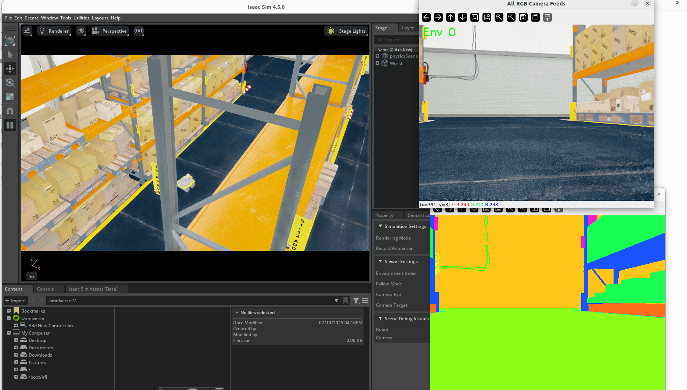
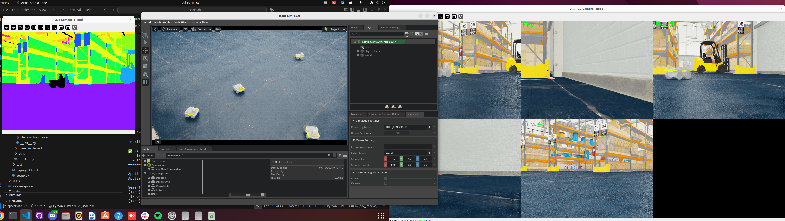

# File Locations and description
The source files are located in
```
source/isaaclab_tasks/isaaclab_tasks/direct/robot_inspection
```

To run a basic interactive file for debuging and visualing run (I broke it lol)
```
source/isaaclab_tasks/isaaclab_tasks/direct/robot_inspection/run_direct_rl_env.py
```
To run Training with SKRL
```
./isaaclab.sh -p scripts/reinforcement_learning/skrl/train.py --task Isaac-Inspection-Camera-Direct-v0 --num_envs 1 --headless --video
```
View training Logs
```
./isaaclab.sh -p -m tensorboard.main --logdir logs/skrl/3DInspection_direct
```

View Trained Trajectory
```
./isaaclab.sh -p scripts/reinforcement_learning/skrl/play.py --task Isaac-Inspection-Camera-Direct-v0 --num_envs 1 --use_last_checkpoint
```

# Reward Design
# First Version
Simple Reward function
$reward = \alpha * \frac{1}{1+d} + \beta * \text{Number of Segementation pixels in camera view}$

Drive the reward to a goal and capture the pixels.

# Environmental Setup
I have a jackal with a RBG and Segementation Camera,
The Inpsection objective is a forklift that comes with the Warehouse Evironment
we rewrote the segemantaion name for the forklift

# Sample Image of Environment (Single Robot/ENV)



# Sample Image of Environment (Multi Robot/ENV) STILL BROKEN CAUSE TERRAIN WONT REPLICATE!


# Things to add
- [ ] Collsion detection and penalty Reward
- [ ] Integrate occupancy Map, compare perfomance to pure camera Input to the inspection problem
- [ ] Integrate ROS (feels like I might most of the tools I need for now)
- [ ]Get Multi Envs working (PRIORITY -SPEED TRAINING)
- [x] Mechanism to label my own Segmentaion categories in the Simulation
- [ ] Different Inspection goals (Fire extinguisher, Traffic cone)
- [ ] Some Goal oriented setup, randomise the inspection goal and give as an input the image of the goal
- [ ] Randomise the starting pose of the robot as well as potentially the Goals
- [ ] Better Mesh environments to experiment on, environment is in ROWS not ideal or interesting maybe find from Fab.com or build ourselves.
- [x] Integrate with the training PPO environments
- [ ] 3D reconstrunction setup and reward for inspection quality and coverage( Gaussian Splatting)
- [ ] Surface normal counting as coverage function ( massk image trajectory with segmantics )
- [ ] Camera Actuator seperate from Robot Actuator ( SImulatre Panning ant tilting) ( Not priority)
- [x] Integrate with WANDB to allow collaborators to view Training results

